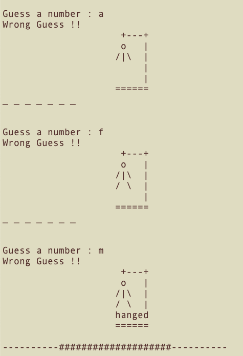
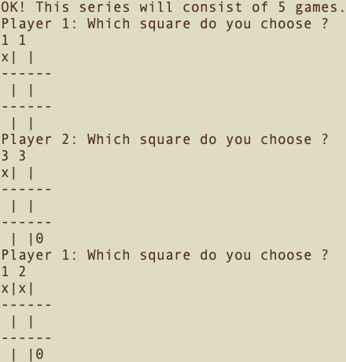

# pygames
Fun games written in python language

1. Hangman Game : Game will pick a word and challenge you to guess it until the hangman is hanged.

2. Tic Tac Toe Game : 3X3 two player board game. Alternately both player marks the symbol until game ends.

